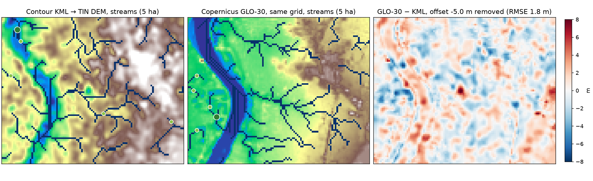

# Terrain-source cross-check — contour KML vs Copernicus GLO-30

Generated by `scripts/crosscheck_dem_sources.py` on the provided sample AOI (89×110 cells at 30 m, EPSG:32644). Both DEMs run through the identical hydrology chain.

| Measure | Value |
|---|---|
| Mean offset GLO-30 − KML | -5.00 m |
| RMSE (raw / offset removed) | 5.30 m / 1.77 m |
| Pearson correlation of elevations | 0.936 |
| KML channel cells within 1 cell of a GLO-30 channel | 47% |
| GLO-30 channel cells within 1 cell of a KML channel | 43% |
| Major channels (≥ 50 ha) of the KML path within 2 cells of GLO-30's | 41% |
| Largest drainage area in the map, KML / GLO-30 | 416 ha / 488 ha |
| Distance between the two top-ranked sites | 1,608 m |
| Cells mapped as water by the GLO-30 water body mask | 1030 |

Catchment area at the KML path's ranked sites, each snapped on its own model:

| Site | KML path (ha) | GLO-30 path (ha) | Difference |
|---|---|---|---|
| 1 | 28.0 | 2.0 | -93 % |
| 2 | 103.3 | 5.3 | -95 % |
| 3 | 14.3 | 6.9 | -52 % |
| 4 | 19.4 | 426.8 | +2095 % |
| 5 | 8.7 | 13.8 | +58 % |

**Reading.** The two elevation sources agree as *surfaces*: after the datum offset the RMSE is within both products' stated relative accuracy and the correlation is high. They do not agree as *drainage*. The sample is very flat (mean slope ≈ 1.6°, 31 m of relief over 3 km), so a 2 m difference sends a 10–30 ha flow path to the neighbouring hollow, and catchments at the small ranked sites differ by a factor of several. Only the total drainage agrees closely. On the floodplain GLO-30 has a flattened river surface (water-body editing), on which D8 splits the flow into parallel lines; the tile's water body mask is now read with the DEM and excluded from siting with the flood-belt buffer, so no site lands in the river. pysheds on the *same* DEM matched our catchments within 2–3 % (ADR 0015): the algorithm is not the uncertainty — **the source DEM is**. Hence the ±15–50 % band and confidence label on every catchment, the visible snap distance, and the report's statement that on flat land the outlet must be checked in the field before construction.

